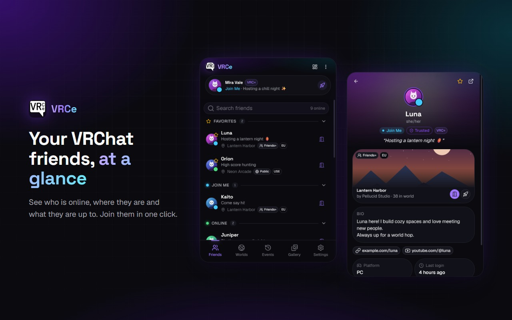
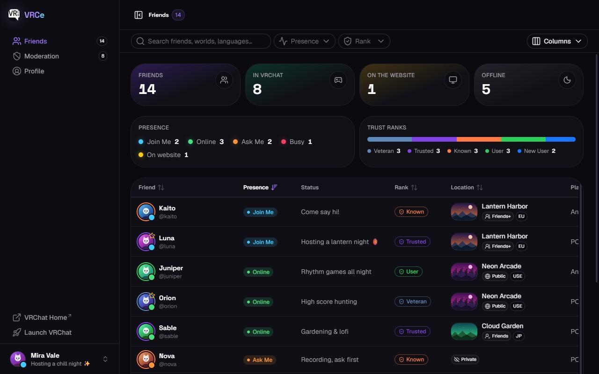

<div align="center">


# VRCe

**Manage your VRChat experience, right from your browser.**

A browser extension that turns your vrchat.com session into a live companion: see where your
friends are, join them in one click, follow what happens and get notified when it matters.

[](LICENSE.md)
[](https://chrome.google.com/webstore/detail/vrce-manage-your-vrchat-e/ifehdekkdpiljkefhbhabpngnjdhloia)




</div>

---

## ✨ Features

### 👥 Friends at a glance

- Friends grouped by **presence** (Join Me, Online, Ask Me, Busy, on the website, offline), with your **favorites** pinned on top.
- See each friend's **world**, instance type and region, and **join them in one click** with a self invite.
- Right-click a friend to favorite them, open their details or their vrchat.com profile.
- A **details panel** with their status, trust rank, bio, links, platform, last login and current world.

### 🌍 Worlds & events

- **Worlds** groups the instances your friends are in, with who's inside, a Join button and Open in VRChat.
- **Events** is a live timeline of your friends' activity from the VRChat pipeline: coming online, world hops,
  profile changes (with a before → after diff), invites and requests. Grouped by day, filterable and searchable.
- Events are kept for 24 hours, even when the popup is closed.

### 🔔 Notifications

- Desktop notifications when **any friend** or only your **favorite friends** come online.
- Notifications for **invites, invite requests, replies, friend requests and boops**.
- A "Disconnected" notification when your vrchat.com session expires, one click away from logging back in.

### 🖼️ Gallery (VRC+)

- Browse your uploaded **icons and photos**, switch your **user icon** in one click and delete pictures.

### 📊 Dashboard

- A full-page view with a **friends table**: presence, status, trust rank, world, platform, languages, last login…
  with search, filters, sorting and a column picker.
- **Stats** on your friends (presence breakdown, trust rank distribution).
- Your **moderation history** (blocks, mutes, hidden avatars…) and your **profile** with past display names and status history.

<div align="center">

</div>

### 🎨 Aurora theme

- A dark, electric violet theme built with Nuxt UI, shared by the popup and the dashboard.

---

## 📥 Install

- **Chrome / Chromium browsers**: [Chrome Web Store](https://chrome.google.com/webstore/detail/vrce-manage-your-vrchat-e/ifehdekkdpiljkefhbhabpngnjdhloia)
- **Firefox**: [Firefox Add-ons](https://addons.mozilla.org/en-US/firefox/addon/vrc-e/) (1.x, the Manifest V3 version is Chrome only for now)

VRCe uses your existing session: log in on [vrchat.com](https://vrchat.com/home/login) and open the extension.
Your credentials never go through the extension.

---

## 🧱 How it works

| Path                  | What it is                                                                                                     |
|-----------------------|----------------------------------------------------------------------------------------------------------------|
| `src/background`      | **Service worker**: pipeline WebSocket, event history (IndexedDB), desktop notifications, connection status.   |
| `src/popup`           | **Popup**: friends, worlds, events, gallery and settings tabs.                                                 |
| `src/standalone`      | **Dashboard** page (`index.html`): friends table, moderation history and profile.                              |
| `src/shared`          | VRChat API client, extension storage and messaging between the pages and the service worker.                   |
| `src/composables`     | Shared state: session, friends, worlds, events, friend details.                                                |
| `src/components/base` | Base components: avatars with presence, presence / rank / location badges, session gate.                       |
| `src/types`           | VRChat API types generated from the [vrchat.community](https://vrchat.community) specification.                |
| `build`               | Dev auto reload plugin and Chrome Web Store packaging script.                                                  |

```text
 vrchat.com session cookie
          │
          ▼
 Service worker ◄──WebSocket── VRChat pipeline (pipeline.vrchat.cloud)
   │    │
   │    ├── IndexedDB (24h event history)
   │    └── Desktop notifications
   │
   └──port──► Popup / Dashboard ──REST──► VRChat API (vrchat.com/api/1)
```

The service worker is kept alive while the pipeline is connected, and an alarm reconnects it if Chrome stopped it.

---

## 🚀 Getting started

### Prerequisites

- [Node.js](https://nodejs.org/) 20.19+ or 22.12+
- A Chromium based browser (Chrome 116+)

### Install

```bash
git clone git@github.com:ChxGuillaume/VRCe.git
cd VRCe
npm ci
```

### Run in development

```bash
npm run serve
```

Then load the `dist` folder once as an [unpacked extension](https://developer.chrome.com/docs/extensions/get-started/tutorial/hello-world#load-unpacked)
from `chrome://extensions` (Developer mode).

The extension is rebuilt on every change and **reloads itself**: UI changes reload the open extension pages, background
or manifest changes reload the whole extension (which closes the popup and extension tabs). Auto reload talks to a local
server on port `35729`, set `VRCE_DEV_RELOAD_PORT` to use another one. Production builds don't include it.

---

## 📦 Building

```bash
npm run build     # Type-check and build the extension into dist/
npm run package   # Build, check the manifest against the Chrome Web Store rules and zip it into artifacts/vrce-<version>.zip
```

### Releases

1. Bump the `version` in `package.json` (the store rejects already published versions) and update [`CHANGELOG.md`](CHANGELOG.md).
2. Run `npm run package`.
3. Upload `artifacts/vrce-<version>.zip` from the [Chrome Web Store developer dashboard](https://chrome.google.com/webstore/devconsole).

---

## 🛠️ Development scripts

| Command                      | Description                                                            |
|------------------------------|------------------------------------------------------------------------|
| `npm run serve`              | Development build in watch mode, with auto reload                      |
| `npm run build`              | Type-check and production build                                        |
| `npm run package`            | Production build zipped for the Chrome Web Store                       |
| `npm run typecheck`          | Type-check the project with `vue-tsc`                                  |
| `npm run lint`               | ESLint across the whole project                                        |
| `npm run generate:api-types` | Regenerate the VRChat API types from the vrchat.community OpenAPI spec |

To update the API types, bump the specification version in the `generate:api-types` script of `package.json` first.

---

## 🤝 Contributing

Issues and pull requests are welcome. Before opening a PR, please run `npm run lint` and `npm run typecheck`.

The VRChat API is not officially documented: VRCe follows the community maintained documentation at
[vrchat.community](https://vrchat.community). If something broke after a VRChat update, check it there first.

---

## 📑 Changelog

See [`CHANGELOG.md`](CHANGELOG.md). Versions are bumped for every Web Store release.

---

## 📄 License

VRCe is free software: you can redistribute it and/or modify it under the terms of
the **GNU General Public License v3.0**. See [`LICENSE.md`](LICENSE.md) for the full text.

This project is not affiliated with or endorsed by VRChat Inc.
